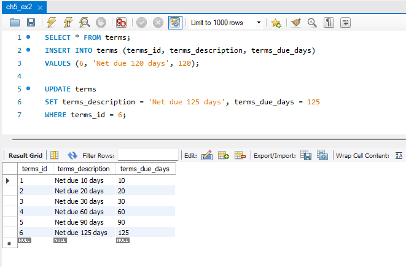

# DBA-120-OA! Exam 1

## Exercise 1: [ch5_ex1.sql](ch5_ex1.sql)

```
SELECT * FROM terms;
INSERT INTO terms (terms_id, terms_description, terms_due_days)
VALUES (6, 'Net due 120 days', 120);
```


This excersice used an 'insert' statement that created a new row in a table

---
## Exercise 2: [ch5_ex2.sql](ch5_ex2.sql)

```
UPDATE terms
SET terms_description = 'Net due 125 days', terms_due_days = 125
WHERE terms_id = 6;
```



This excersize `UPDATED` a row with modified data

---
## Exercise 3: [ch5_ex3.sql](ch5_ex3.sql)

```
DELETE FROM terms WHERE terms_id = 6
```


I deleted the 6th row from the table

---
## Exercise 4: [ch5_ex4.sql](ch5_ex4.sql)

```
SELECT * FROM ap.invoices;
INSERT INTO invoices VALUES 
(116, 32, 'AX-014-027', '2018-08-01', 
434.58, 0, 0, 2, '2018-08-31', NULL)
```


I INSERTED new data into an existing row

---
## Exercise 5: [ch5_ex5.sql](ch5_ex5.sql)

```
SELECT * FROM ap.invoice_line_items;
INSERT INTO invoice_line_items VALUES
(115, 1, 160, 180.23, 'Hard drive'),
(116, 2, 527, 254.35, 'Exchange Server update')
```


I modified more data from a different table

---
## Exercise 6: [ch5_ex6.sql](ch5_ex6.sql)

```
SELECT * FROM ap.invoices;

UPDATE invoices
SET credit_total = invoice_total * 0.1,
payment_total = invoice_total - credit_total
WHERE invoice_id = 116;
```


In this example, I assigned new credit totals by multiplying an integer by an existing number in the credit_totals fieild

---
## Exercise 7: [ch5_ex7.sql](ch5_ex7.sql)

```
SELECT * FROM ap.vendors;
UPDATE vendors
SET default_account_number = 403
WHERE vendor_id = 44
```


I updated data in a field by setting a new integer to a specified vendor_id

---
## Exercise 8: [ch5_ex8.sql](ch5_ex8.sql)

```
SELECT * FROM ap.invoices;

UPDATE invoices
SET terms_id = 2
WHERE vendor_id IN (SELECT vendor_id
FROM vendors WHERE default_terms_id =2);

```


This was an interesting one becuase I modified data in the invoice table by referencing information from the vendors table

---
## Exercise 9: [ch5_ex9.sql](ch5_ex9.sql)

```
SELECT * FROM ap.invoices;

DELETE FROM invoice_line_items
WHERE invoice_id = 116;

DELETE FROM invoices
WHERE invoice_id = 116;

```


This example we deleted the rows that we added to tables from the Ch.5 examples
