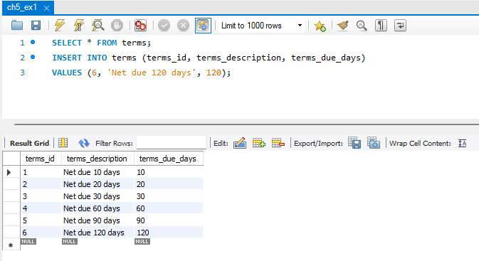
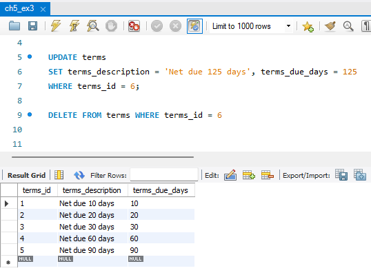
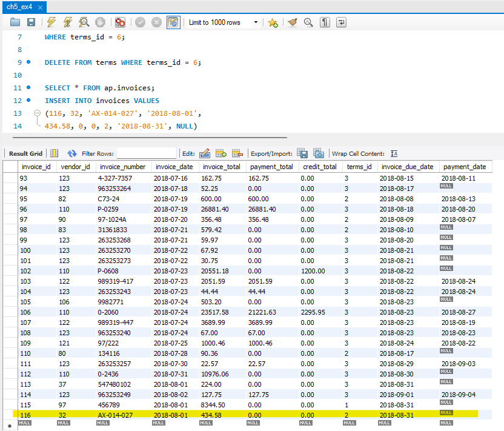
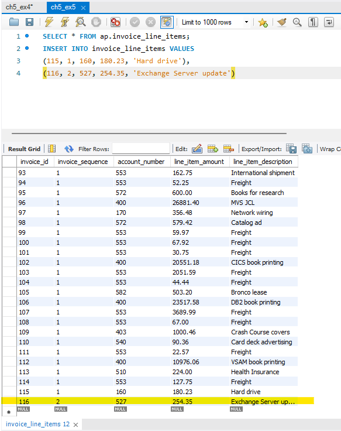
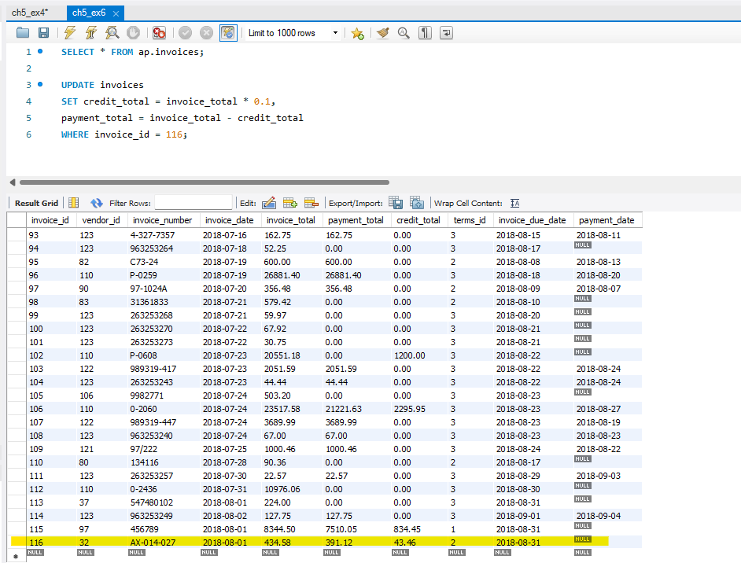
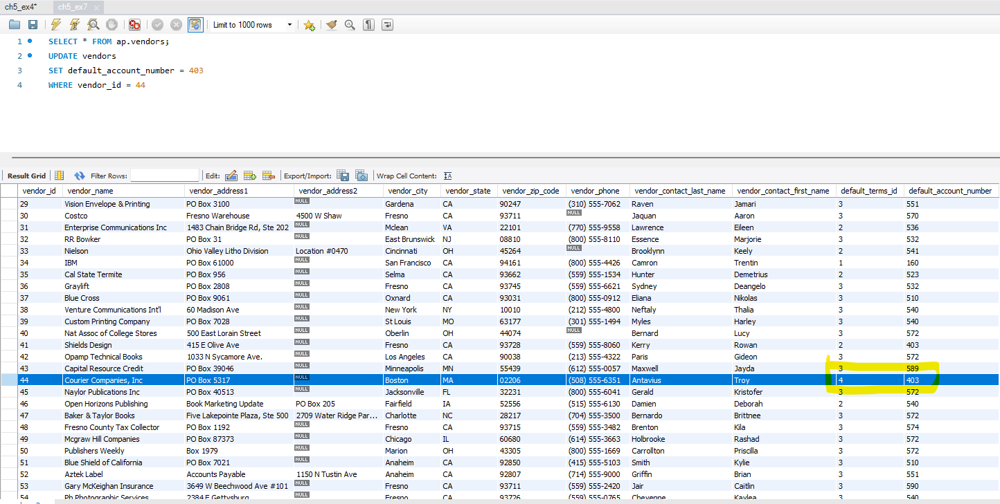
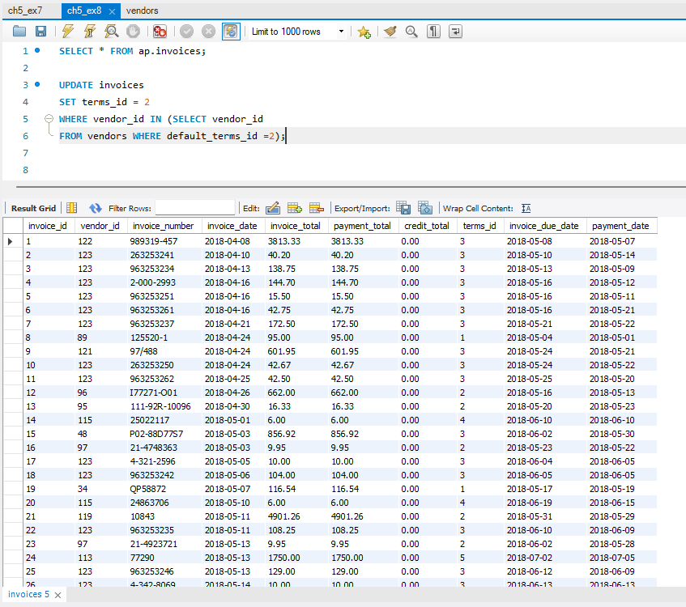
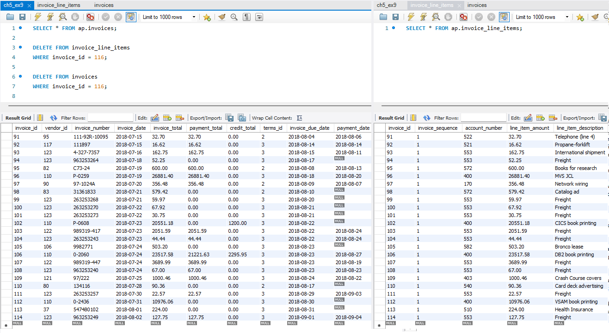

# DBA-120-OA! Exam 1

## Exercise 1: [ch5_ex1.sql](ch5_ex1.sql)

```
SELECT * FROM terms;
INSERT INTO terms (terms_id, terms_description, terms_due_days)
VALUES (6, 'Net due 120 days', 120);
```



This excersice used an 'insert' statement that created a new row in a table

---
## Exercise 2: [ch5_ex2.sql](ch5_ex2.sql)

```
SELECT * FROM terms;
INSERT INTO terms (terms_id, terms_description, terms_due_days)
VALUES (6, 'Net due 120 days', 120);

UPDATE terms
SET terms_description = 'Net due 125 days', terms_due_days = 125
WHERE terms_id = 6;
```


---
## Exercise 3: [ch5_ex3.sql](ch5_ex3.sql)

```
code here
```



description here

---
## Exercise 4: [ch5_ex4.sql](ch5_ex4.sql)

```
code here
```



description here

---
## Exercise 5: [ch5_ex5.sql](ch5_ex5.sql)

```
code here
```



description here

---
## Exercise 6: [ch5_ex6.sql](ch5_ex6.sql)

```
code here
```



description here

---
## Exercise 7: [ch5_ex7.sql](ch5_ex7.sql)

```
code here
```



description here

---
## Exercise 8: [ch5_ex8.sql](ch5_ex8.sql)

```
code here
```



description here

---
## Exercise 9: [ch5_ex9.sql](ch5_ex9.sql)

```
code here
```



description here
